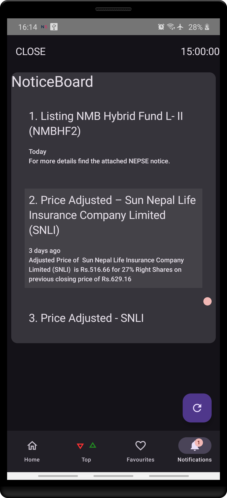

# A. HyperNepse
An alternative android(7.0+) frontend for [Nepse](https://www.nepalstock.com.np).  

# B. What is this project?
This place serves as the release repository for `HyperNepse` android apk.  
It's based on my earlier project [NepseUnofficialAPI](https://www.github.com/basic-bgnr/nepseunofficialapi.git).  

# C. Why this project?
* Nepse's website on mobile data was burning holes in my wallet.
* I have an old phone and needed something that would use nominal data and would run quickly.
* I've never tried android/kotlin development ever in my life, so this was an excuse to scratch the itch.

# D. ScreenShots

# E. Changelogs
1. Patch fix `v0.1.1` [June 17, 2025]
    * fixes `json decode` and `ui` bugs.
1. Initial release `v0.1.0`, [April 20, 2025]
